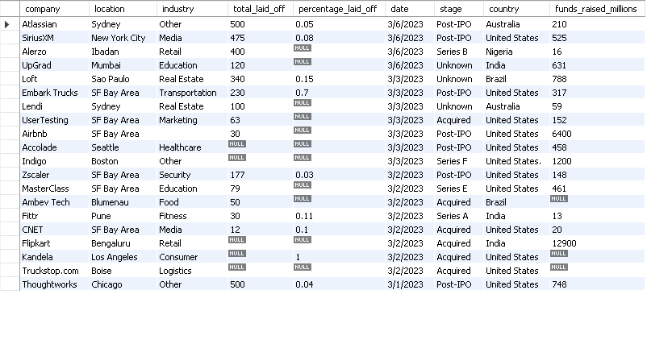
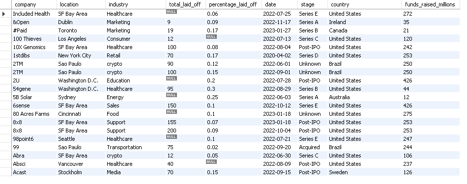

# 📊 SQL Data Cleaning | Global Layoffs Dataset


---

## 📌 Overview

This project focuses on cleaning a real-world **Global Layoffs** dataset using **MySQL**. The objective was to transform raw data into a clean and reliable dataset for further analysis.

---

## 🛠️ Tools Used

- MySQL Workbench
- SQL

---

## 📂 Dataset

**Source:** Kaggle – Global Layoffs Dataset

---

## 🔄 Project Workflow

```text
Raw Data
   ↓
Staging Table
   ↓
Duplicate Removal
   ↓
Data Standardization
   ↓
Missing Value Handling
   ↓
Date Formatting
   ↓
Final Clean Dataset
```

---

## 💻 SQL Techniques Used

- CREATE TABLE
- INSERT
- UPDATE
- DELETE
- ALTER TABLE
- CTE
- ROW_NUMBER()
- Window Functions
- Self Join
- TRIM()
- STR_TO_DATE()

---
---

## 📌 Skills Demonstrated

- SQL
- MySQL
- Data Cleaning
- Data Preparation
- Data Validation
- Data Standardization
- Window Functions
- Common Table Expressions (CTEs)
- Self Join
- Date Functions
- String Functions
- Problem Solving

---
## 🧹 Data Cleaning Process

✅ Created a staging table to preserve the original dataset.

✅ Removed duplicate records using `ROW_NUMBER()` and `PARTITION BY`.

✅ Standardized company names, industry names, and country values.

✅ Converted the `date` column from **TEXT** to **DATE**.

✅ Replaced blank values with `NULL` and populated missing industries using a Self Join.

✅ Removed rows where both `total_laid_off` and `percentage_laid_off` were missing.

✅ Dropped the temporary helper column after completing the cleaning process.

---

## 📁 Project Structure

```text
sql-data-cleaning-global-layoffs
│
├── Dataset
│   └── layoffs.csv
│
├── SQL
│   └── SQL_Data_Cleaning.sql
│
├── Images
│   ├── raw_data_set.png
│   └── final_clean_data_set.png
│
└── README.md
```

---

## 📸 Screenshots

### 🗂️ Raw Dataset



### ✅ Final Cleaned Dataset



---

## 📖 Key Learnings

This project helped me strengthen my SQL skills by working with:

- Window Functions
- Self Joins
- CTEs
- Data Standardization
- Missing Value Handling
- Date Functions
- Real-world Data Cleaning

---

## 🚀 Next Step

The cleaned dataset from this project will be used for **SQL Exploratory Data Analysis (EDA)** to identify trends and generate business insights.

---

## 👨‍💻 Author

**Anand MS**

Aspiring Data Analyst

🔗 GitHub: https://github.com/anand-8590
